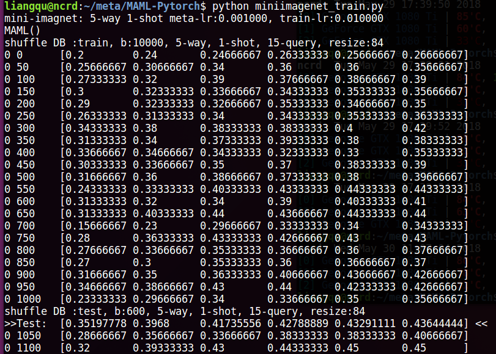
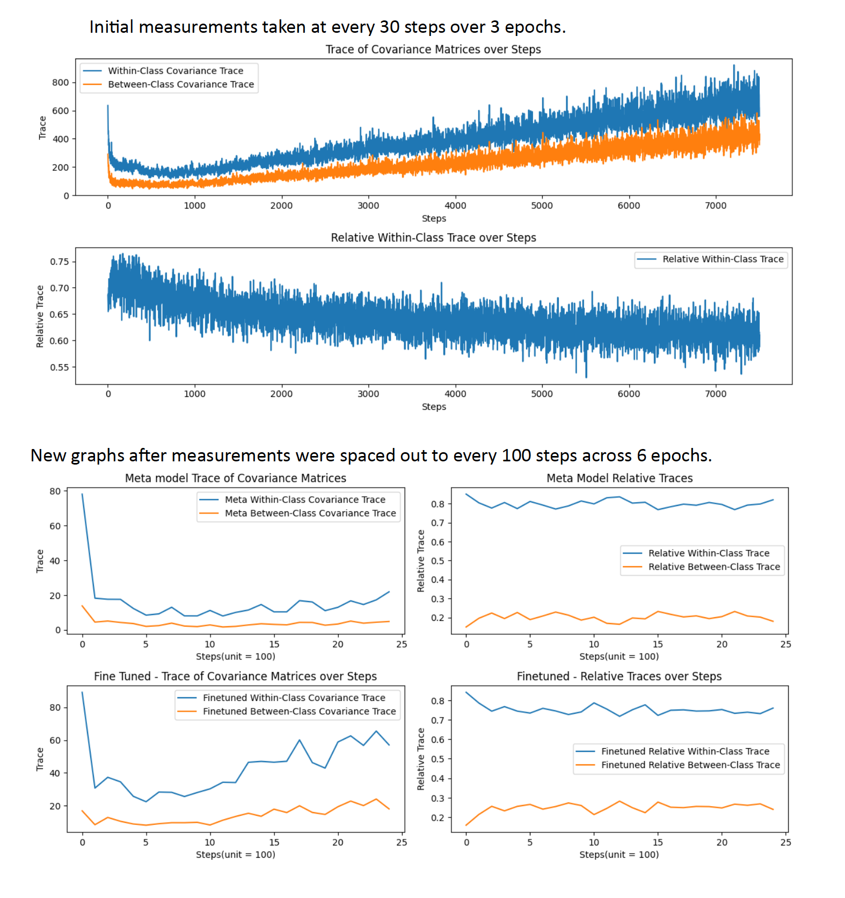

# MAML-NC-Pytorch

PyTorch implementation of the supervised learning experiments from the paper:
[Model-Agnostic Meta-Learning (MAML)](https://arxiv.org/abs/1703.03400).\
Neural Collapse implementation from this paper:
[Feature Learning in Deep Classifiers through Intermediate Neural Collapse](https://proceedings.mlr.press/v202/rangamani23a/rangamani23a.pdf).

## Acknowledgments

I am deeply thankful to Dr. Sen Lin for his exceptional guidance and insights, which were invaluable to the success of this research into the Neural Collapse phenomenon within the MAML architecture.

Special thanks to Liangqu Long, MAML Learner adapted from: https://github.com/dragen1860/MAML-Pytorch

# Platform

- python: 3.x
- Pytorch: 0.4+

# MiniImagenet

## Howto

For 5-way 1-shot exp., it allocates nearly 6GB GPU memory.

1. download `MiniImagenet` dataset from [here](https://github.com/dragen1860/LearningToCompare-Pytorch/issues/4), splitting: `train/val/test.csv` from [here](https://github.com/twitter/meta-learning-lstm/tree/master/data/miniImagenet).
2. extract it like:

```shell
miniimagenet/
├── images
	├── n0210891500001298.jpg
	├── n0287152500001298.jpg
	...
├── test.csv
├── val.csv
└── train.csv


```

3. modify the `path` in `miniimagenet_train.py`:

```python
        mini = MiniImagenet('miniimagenet/', mode='train', n_way=args.n_way, k_shot=args.k_spt,
                    k_query=args.k_qry,
                    batchsz=10000, resize=args.imgsz)
		...
        mini_test = MiniImagenet('miniimagenet/', mode='test', n_way=args.n_way, k_shot=args.k_spt,
                    k_query=args.k_qry,
                    batchsz=100, resize=args.imgsz)
```

to your actual data path.

4. just run `python miniimagenet_train.py` and the running screenshot is as follows:
   

If your reproducation perf. is not so good, maybe you can enlarge your `training epoch` to get longer training. And MAML is notorious for its hard training. Therefore, this implementation only provide you a basic start point to begin your research.
and the performance below is true and achieved on my machine.

## Benchmark

| Model         | Fine Tune | 5-way Acc. |        | 20-way Acc. |        |
| ------------- | --------- | ---------- | ------ | ----------- | ------ |
|               |           | 1-shot     | 5-shot | 1-shot      | 5-shot |
| Matching Nets | N         | 43.56%     | 55.31% | 17.31%      | 22.69% |
| Meta-LSTM     |           | 43.44%     | 60.60% | 16.70%      | 26.06% |
| MAML          | Y         | 48.7%      | 63.11% | 16.49%      | 19.29% |
| **Ours**      | Y         | 46.2%      | 60.3%  | -           | -      |

# Ominiglot

## Howto

run `python omniglot_train.py`, the program will download `omniglot` dataset automatically.

decrease the value of `args.task_num` to fit your GPU memory capacity.

For 5-way 1-shot exp., it allocates nearly 3GB GPU memory.

## Abstract:

This study investigates the presence of neural decay within the Model-Agnostic Meta-Learning (MAML) framework, particularly during the training phase. We measured the activations of the "Meta Model" and the "Finetuned Model" after K gradient updates using within-class and between-class covariance. Our preliminary results suggest a slight decrease in relative within-class traces, indicating potential neural decay.

## Background:

Building upon the concept of Intermediate Neural Collapse (INC) as discussed in previous work (Papyan, Han, & Donoho, 2020), this research explores whether similar phenomena can be observed in the MAML framework. MAML's ability to train models that can quickly adapt to new tasks with few data points makes it critical to understand its behavior as it converges through deeper layers.

Meta-learning has been extensively applied to few-shot classification problems, offering a pathway for models to learn how to learn. MAML stands out due to its generalizability and simplicity (Finn, Abbeel, & Levine, 2017). However, the occurrence of neural decay during its training phase remains unexplored. This study aims to fill that gap by examining whether MAML exhibits neural decay as it approaches convergence.

## Methods

Metrics such as within-class and between-class variances and activations were computed from the Learner Class. During meta-training, we tracked the covariance traces of both the Meta Model and the Finetuned Model post K-gradient updates, which is stated in (Papyan, Han, & Donoho, 2020) as NC1 metric.

Initial measurements were taken every 30 steps, resulting in dense and inconclusive graphs. Subsequently, measurements were spaced out to every 100 steps across 6 epochs. Our analysis focused on the Meta Model's metrics with Query Sets and after K iterations of finetuning.

## Experiments



## Conclusion

The observed trends in our data indicate a nuanced shift in within-class covariance traces over iterative steps, hinting at the potential occurrence of neural decay phenomena within the MAML architecture. These preliminary results, while suggestive, necessitate further empirical investigation to confirm the persistence and implications of this decay. Subsequent research should not only prolong the observation period but also methodically explore the progressive stages of neural collapse, specifically examining phases NC2, NC3, and NC4. This expanded scope is vital for a holistic understanding of neural dynamics in meta-learning models.

## Supplementary material:

1. Feature learning in deep classifiers through Intermediate Neural Collapse (Papyan, Han, & Donoho, 2020)
2. Model-Agnostic Meta-Learning for Fast Adaptation of Deep Networks (Finn, Abbeel, & Levine, 2017)
